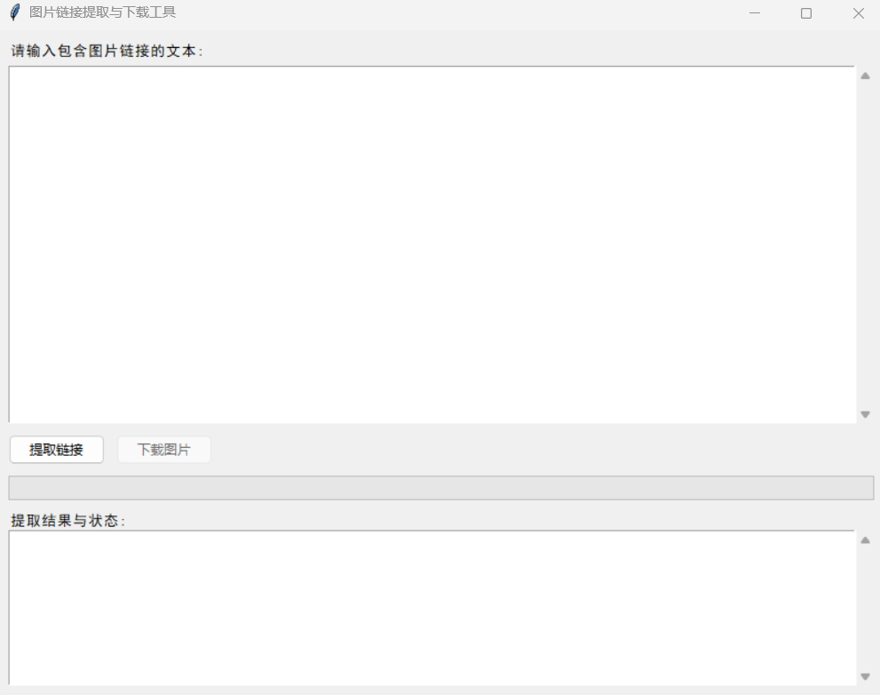

# Image Link Extractor & Downloader

Do you often encounter the issue where, when reposting blogs across different platforms, the platforms cannot directly extract images from external sites? At this point, manual import is required, but downloading one link at a time is extremely cumbersome. This user-friendly desktop application is here to help: built with Tkinter, it extracts Markdown-style image links from text and enables batch downloading. Designed for simplicity and efficiency, it provides real-time progress tracking and automatic folder management.

## Key Features
- **Intuitive GUI**: Clean and responsive interface with Chinese language support (SimHei font)
- **Link Extraction**: Automatically detects Markdown image links using regex pattern matching
- **Batch Downloading**: Downloads multiple images simultaneously in the background (via threading) to prevent UI freezing
- **Progress Tracking**: Visual progress bar and detailed status logs for download monitoring
- **Automatic Organization**: Creates an `image` folder in the project directory (if missing) to store downloaded files
- **File Format Handling**: Supports common image formats (JPG, PNG, GIF, BMP, WebP) with automatic format fallback
- **Error Handling**: Robust error reporting for failed downloads (timeouts, invalid URLs, etc.)

## Interface Preview
  
*Note: Add screenshots to the `screenshots` folder and update the path above*

## Supported Image Formats
- JPG/JPEG
- PNG
- GIF
- BMP
- WebP  
*Automatically falls back to JPG for unrecognized formats*

## Installation

### Prerequisites
- Python 3.6 or higher (Python 3.8+ recommended)
- pip (Python package manager)

### Steps
1. Clone the repository:
   ```bash
   git clone https://github.com/ChenAI-TGF/Extract_Fig_From_Markdown.git
   cd image-link-extractor
   ```

2. Install required dependencies:
   ```bash
   pip install -r requirements.txt
   ```

## Usage Guide
1. Launch the application:
   ```bash
   python main.py
   ```

2. Paste text containing Markdown image links into the input area 

3. Click **"提取链接" (Extract Links)** to detect image URLs:
   - Successfully extracted links will appear in the results panel
   - The download button will activate if links are found

4. Click **"下载图片" (Download Images)** to start downloading:
   - Progress will be shown in the progress bar
   - Status updates (success/failure) will appear in the results panel
   - Images are saved to the `image` folder in the project directory

5. After completion, a summary message will display the number of successful downloads and the save path

## Project Structure
```
.
├── main.py               # Core application code with GUI and logic
├── requirements.txt      # Dependencies (requests)
├── LICENSE               # MIT License
├── README.md             # Project documentation
├── screenshots/          # Optional: Application screenshots
└── image/                # Auto-created folder for downloaded images
```

## Technical Details
- **GUI Framework**: Tkinter (built-in Python library)
- **Network Requests**: `requests` library for image downloading
- **Concurrency**: Threading to prevent UI freezing during downloads
- **Regex Pattern**: `!\[.*?\]\((.*?)\)` for Markdown image link detection
- **Error Handling**: Timeout handling (10s), HTTP error checking, and file I/O validation

## License
This project is licensed under the MIT License - see the [LICENSE](LICENSE) file for details.


# 图片链接提取与下载工具

你是否经常面临在不同平台之间转载博客时，平台无法直接提取外站图片的问题？这时就需要手动导入，而一个链接一个链接地下载又极为麻烦。这款用户友好的桌面应用程序正是为解决此问题而生：它基于 Tkinter 构建，能从文本中提取 Markdown 格式的图片链接 并支持批量下载。其设计注重简洁与高效，提供实时进度跟踪和自动文件夹管理功能。

## 核心功能
- **直观界面**：简洁响应式图形界面，支持中文显示（采用SimHei字体）
- **链接提取**：通过正则表达式自动识别Markdown格式的图片链接
- **批量下载**：后台多线程下载（避免界面冻结）
- **进度跟踪**：可视化进度条和详细状态日志，实时监控下载过程
- **自动整理**：在项目目录中自动创建`image`文件夹（若不存在）用于存储图片
- **格式处理**：支持常见图片格式（JPG、PNG、GIF、BMP、WebP），格式不识别时自动 fallback 为JPG
- **错误处理**：对下载失败情况（超时、无效链接等）提供详细错误报告

## 界面预览
  
*注：请将截图添加到`screenshots`文件夹并更新上方路径*

## 支持的图片格式
- JPG/JPEG
- PNG
- GIF
- BMP
- WebP  
*对于未识别的格式，自动默认保存为JPG*

## 安装步骤

### 前置要求
- Python 3.6或更高版本（推荐Python 3.8+）
- pip（Python包管理器）

### 安装流程
1. 克隆仓库：
   ```bash
   git clone https://github.com/ChenAI-TGF/Extract_Fig_From_Markdown.git
   cd image-link-extractor
   ```

2. 安装依赖：
   ```bash
   pip install -r requirements.txt
   ```

## 使用指南
1. 启动应用：
   ```bash
   python main.py
   ```

2. 在输入区域粘贴包含Markdown图片链接的文本

3. 点击**"提取链接"**按钮检测图片URL：
   - 成功提取的链接会显示在结果面板中
   - 若检测到链接，下载按钮将被激活

4. 点击**"下载图片"**开始下载：
   - 进度条会显示下载进度
   - 结果面板会实时更新状态（成功/失败信息）
   - 图片将保存到项目目录下的`image`文件夹中

5. 下载完成后，会显示汇总信息，包括成功下载数量和保存路径

## 项目结构
```
.
├── main.py               # 核心应用代码（包含GUI和业务逻辑）
├── requirements.txt      # 依赖库列表（requests）
├── LICENSE               # MIT许可证
├── README.md             # 项目文档
├── screenshots/          # 可选：应用程序截图
└── image/                # 自动创建的下载图片存储文件夹
```

## 技术细节
- **GUI框架**：Tkinter（Python内置库）
- **网络请求**：`requests`库用于图片下载
- **并发处理**：多线程机制避免下载时界面冻结
- **正则表达式**：`!\[.*?\]\((.*?)\)`用于匹配Markdown图片链接
- **错误处理**：10秒超时控制、HTTP错误检查和文件I/O验证

## 许可证
本项目基于MIT许可证开源 - 详见[LICENSE](LICENSE)文件。
```
